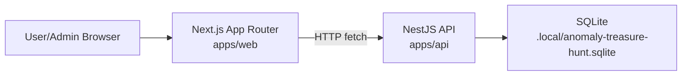
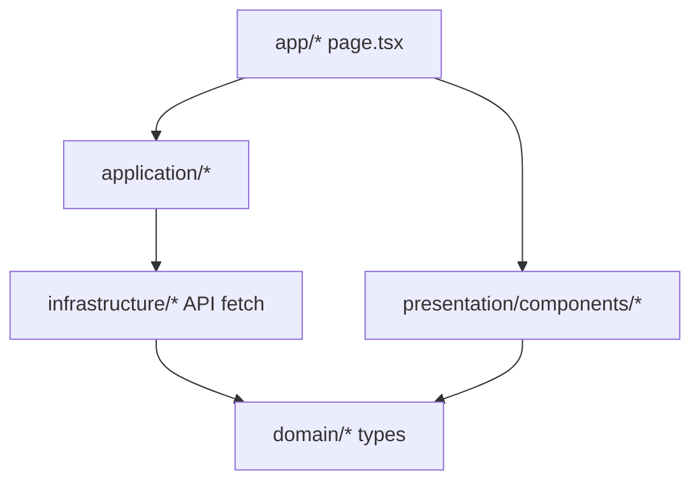
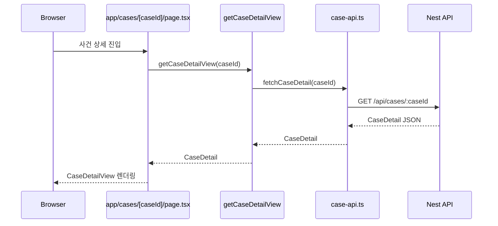
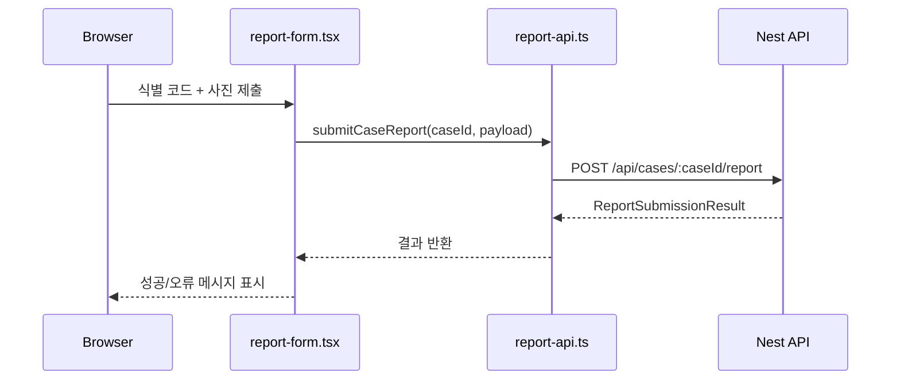
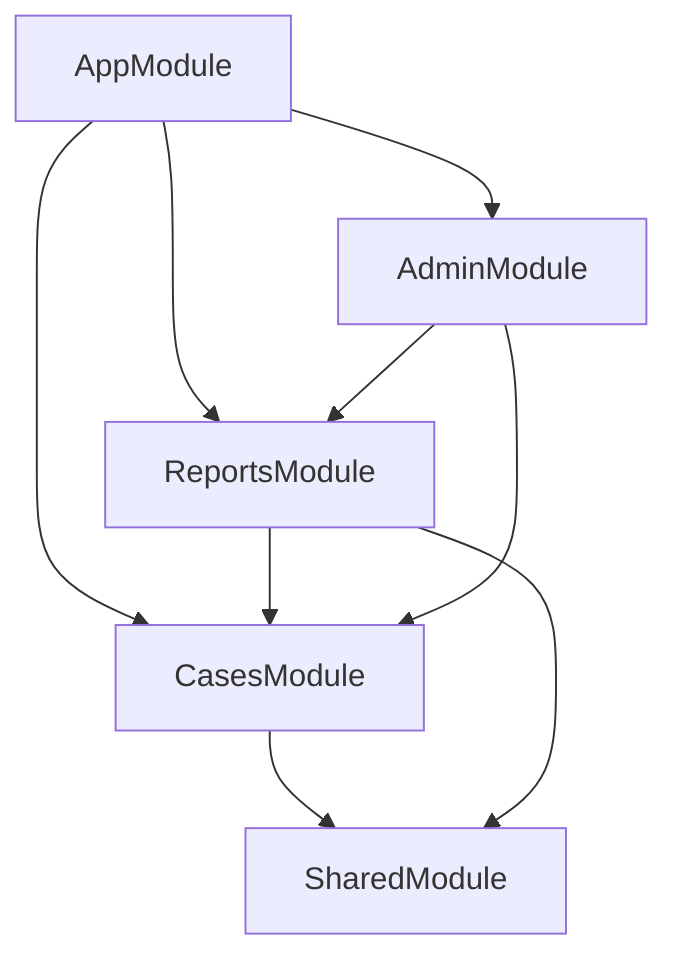
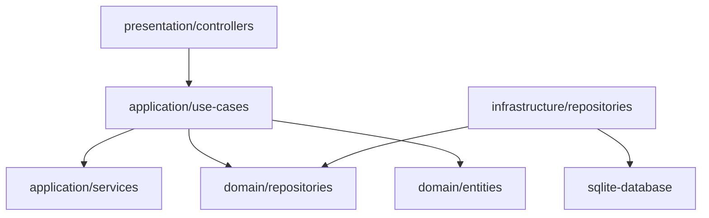
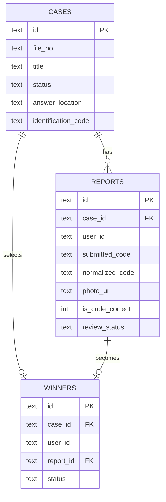

# Anomaly Treasure Hunt Architecture

이 문서는 현재 저장소의 FE/BE 구조를 빠르게 파악하기 위한 개요 문서다.
기준 시점은 현재 MVP 코드베이스이며, 아직 Supabase 연동 전의 데모 인증 헤더와 SQLite 기반 구현을 포함한다.

## 1. 전체 구조



## 2. Frontend 구조

### 2.1 폴더 개요

```text
apps/web/src
├─ app
│  ├─ layout.tsx                # 전체 레이아웃, AppShell 적용
│  ├─ page.tsx                  # 홈
│  ├─ admin/page.tsx            # 관리자 화면
│  ├─ cases/page.tsx            # 사건 목록
│  ├─ cases/[caseId]/page.tsx   # 사건 상세
│  ├─ cases/[caseId]/report     # 제보 제출
│  ├─ cases/[caseId]/result     # 결과 조회
│  └─ me/reports/page.tsx       # 내 제보 이력
├─ lib
│  └─ config.ts                 # API base URL, 데모 유저/관리자 헤더
└─ modules
   ├─ home
   ├─ cases
   ├─ reports
   ├─ admin
   └─ shared
```

### 2.2 FE 레이어 규칙



설명:

- `app/*`는 Next App Router 진입점이다.
- `application/*`는 화면에 필요한 데이터를 조합한다.
- `infrastructure/*`는 API 호출을 담당한다.
- `domain/*`는 화면에서 쓰는 타입 정의다.
- `presentation/components/*`는 실제 UI를 렌더링한다.

### 2.3 현재 주요 사용자 흐름

```mermaid
flowchart LR
    Home[/app/page.tsx/]
    Cases[/app/cases/page.tsx/]
    Detail[/app/cases/[caseId]/page.tsx/]
    Report[/app/cases/[caseId]/report/page.tsx/]
    Result[/app/cases/[caseId]/result/page.tsx/]
    MyReports[/app/me/reports/page.tsx/]
    Admin[/app/admin/page.tsx/]

    Home --> Cases
    Cases --> Detail
    Detail --> Report
    Detail --> Result
    Report --> Result
    Home --> MyReports
    Home --> Admin
```

### 2.4 핵심 FE 파일

- `apps/web/src/app/layout.tsx`
  - 전역 레이아웃과 `AppShell`을 적용한다.
- `apps/web/src/lib/config.ts`
  - `NEXT_PUBLIC_API_BASE_URL`과 데모 헤더 생성 로직이 있다.
- `apps/web/src/modules/cases/infrastructure/case-api.ts`
  - 사건 목록, 상세, 결과, 관리자 사건 API를 호출한다.
- `apps/web/src/modules/reports/infrastructure/report-api.ts`
  - 제보 제출과 내 제보 이력 API를 호출한다.
- `apps/web/src/modules/admin/application/get-admin-dashboard-view.ts`
  - 관리자 화면용 사건 목록과 첫 사건의 제보 목록을 묶어서 가져온다.

### 2.5 FE에서 요청이 흐르는 방식

예시: 사건 상세 페이지



예시: 제보 제출



## 3. Backend 구조

### 3.1 폴더 개요

```text
apps/api/src
├─ main.ts                      # Nest 부트스트랩
├─ app.module.ts                # 최상위 모듈 조립
└─ modules
   ├─ shared
   │  ├─ shared.module.ts
   │  └─ infrastructure
   │     ├─ sqlite-database.ts
   │     └─ sqlite-seed.ts
   ├─ cases
   ├─ reports
   └─ admin
```

### 3.2 BE 모듈 관계



### 3.3 각 모듈 역할

#### SharedModule

- 전역 `SqliteDatabase` 제공
- DB 스키마 생성
- 시드 데이터 동기화

핵심 파일:

- `apps/api/src/modules/shared/infrastructure/sqlite-database.ts`
- `apps/api/src/modules/shared/infrastructure/sqlite-seed.ts`

#### CasesModule

- 사건 목록 조회
- 현재 공개 사건 조회
- 사건 상세 조회

구성:

- `presentation/controllers/cases.controller.ts`
- `application/use-cases/*`
- `application/services/case-response.mapper.ts`
- `infrastructure/repositories/sqlite-case.repository.ts`

#### ReportsModule

- 제보 제출
- 내 제보 목록 조회
- 사건 결과 조회

구성:

- `presentation/controllers/reports.controller.ts`
- `application/use-cases/*`
- `application/services/identification-code.service.ts`
- `infrastructure/repositories/sqlite-investigation-report.repository.ts`

#### AdminModule

- 관리자 사건 목록/생성/수정
- 사건별 제보 검토
- 당첨자 추첨
- 보상 상태 갱신

구성:

- `presentation/controllers/admin.controller.ts`
- `application/use-cases/*`

### 3.4 BE 레이어 규칙



설명:

- Controller는 HTTP 입구다.
- Use case는 실제 비즈니스 흐름을 담당한다.
- Domain entity는 사건/제보 상태를 표현한다.
- Repository interface와 implementation을 분리해 두었다.
- 현재 구현체는 SQLite 기반이다.

### 3.5 데이터 저장 구조



## 4. 현재 요청 흐름 요약

### 사용자 관점

1. 브라우저가 Next 페이지에 진입한다.
2. 페이지 또는 컴포넌트가 `application` 함수를 호출한다.
3. `infrastructure`가 Nest API로 `fetch`를 보낸다.
4. API는 Controller -> UseCase -> Repository 순서로 처리한다.
5. SQLite에서 읽거나 쓴 뒤 JSON을 반환한다.
6. Next가 화면을 렌더링한다.

### 관리자 관점

1. `/admin` 페이지가 관리자용 사건 목록을 읽는다.
2. 첫 사건을 기준으로 제보 목록을 다시 읽는다.
3. 관리자 액션은 `/api/admin/*` 엔드포인트로 전달된다.
4. Admin use case가 Cases/Reports 데이터를 조합해 상태를 갱신한다.

## 5. 지금 구조에서 알아둘 점

- FE 인증은 아직 실제 Auth가 아니라 `x-user-id`, `x-user-role` 데모 헤더를 쓴다.
- BE 저장소는 Supabase가 아니라 로컬 SQLite다.
- 사건 내용은 `sqlite-seed.ts`에서 시드 데이터로 공급된다.
- 사진 업로드는 실제 스토리지 업로드가 아니라 파일명 기반의 `photoUrl` 문자열로 처리한다.
- 즉, 현재 구조는 MVP 화면/흐름 검증용 뼈대이고, 이후 Supabase Auth/Storage/Postgres로 교체될 지점이 명확히 분리되어 있다.

## 6. 추천 읽기 순서

구조 파악을 빠르게 하려면 아래 순서가 좋다.

1. `apps/web/src/app`
2. `apps/web/src/modules/cases/infrastructure/case-api.ts`
3. `apps/web/src/modules/reports/infrastructure/report-api.ts`
4. `apps/api/src/app.module.ts`
5. `apps/api/src/modules/shared/infrastructure/sqlite-database.ts`
6. `apps/api/src/modules/cases`
7. `apps/api/src/modules/reports`
8. `apps/api/src/modules/admin`
