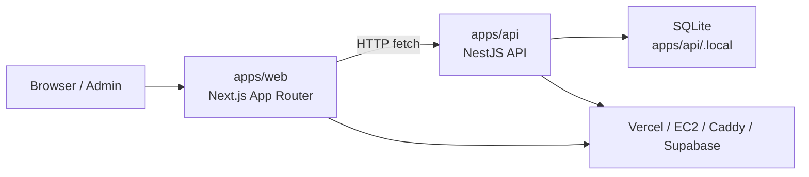
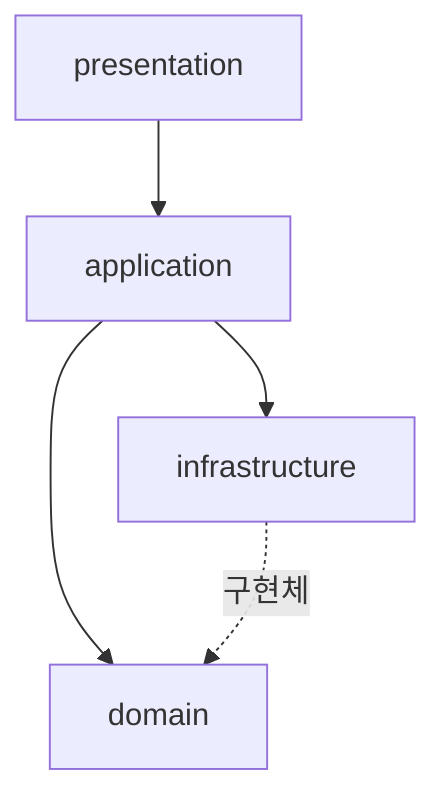
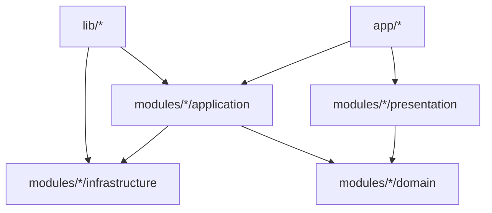
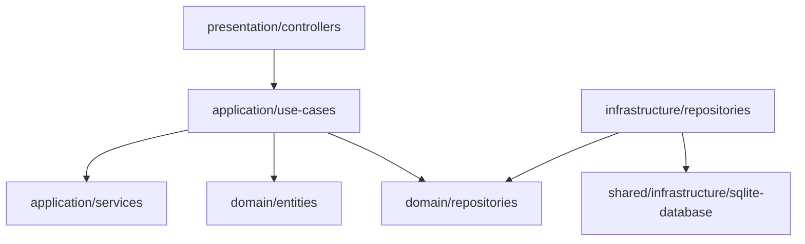
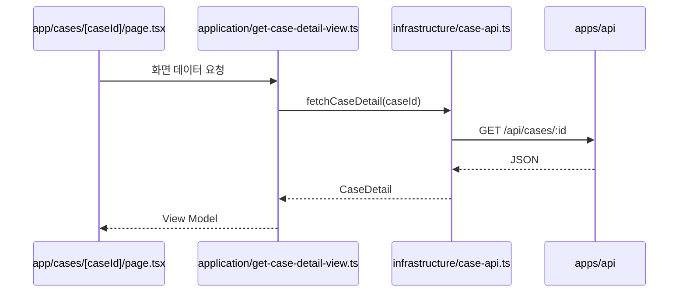
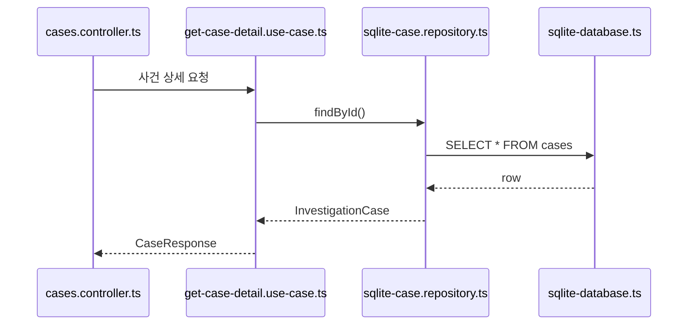

# Project Structure vs Architecture

이 문서는 현재 코드베이스의 **실제 프로젝트 구조**와 **프로그램 아키텍처 계층 구조**를 나란히 비교해서 보여준다.

목적은 두 가지다.

1. 폴더를 봤을 때 어느 레이어인지 바로 이해하기
2. 현재 구현이 의도한 아키텍처와 얼마나 맞아 있는지 빠르게 점검하기

기준 시점:

- FE: Next.js App Router (`apps/web`)
- BE: NestJS + SQLite (`apps/api`)
- 배포: FE Vercel / BE EC2-Docker

## 1. 한눈에 보는 전체 도식



## 2. 실제 프로젝트 구조

```text
weird_phenomenon/
├─ apps/
│  ├─ web/                         # 프론트엔드 앱
│  │  ├─ public/                  # 정적 이미지, 대표 썸네일 자산
│  │  └─ src/
│  │     ├─ app/                  # Next App Router 진입점
│  │     ├─ lib/                  # 공용 설정, auth, supabase, api helpers
│  │     ├─ modules/              # 도메인별 FE 모듈
│  │     └─ proxy.ts              # 미들웨어/매처
│  └─ api/                        # 백엔드 앱
│     ├─ src/
│     │  ├─ main.ts               # Nest 부트스트랩
│     │  ├─ app.module.ts         # 최상위 모듈 조립
│     │  └─ modules/              # 도메인별 BE 모듈
│     └─ .local/                  # SQLite 파일
├─ backlog/                       # 작업 백로그 문서
├─ docs/                          # 구조/배포/인증 문서
├─ deploy.sh / deploy.bat         # 통합 배포 스크립트
└─ README.md
```

## 3. 의도한 아키텍처 구조

현재 프로젝트는 FE와 BE 모두 아래 계층 분리를 따르려고 한다.



설명:

- `presentation`: 화면, 컴포넌트, 컨트롤러, 사용자 입력 진입점
- `application`: 유스케이스, 화면 조합, 서비스 흐름
- `domain`: 타입, 엔티티, 규칙, 저장소 인터페이스
- `infrastructure`: API 호출, DB 접근, 외부 시스템 구현체

## 4. 프론트엔드 구조 vs 아키텍처

### 4.1 실제 폴더

```text
apps/web/src/
├─ app/
│  ├─ page.tsx
│  ├─ guide/page.tsx
│  ├─ cases/
│  ├─ me/reports/
│  └─ admin/
├─ lib/
│  ├─ auth.ts
│  ├─ config.ts
│  └─ supabase/
└─ modules/
   ├─ home/
   ├─ cases/
   ├─ reports/
   ├─ admin/
   ├─ auth/
   └─ shared/
```

### 4.2 아키텍처 매핑



### 4.3 대응표

| 실제 위치 | 아키텍처 레이어 | 역할 |
|---|---|---|
| `apps/web/src/app/*` | Presentation Entry | 라우트 진입점, 페이지 조립 |
| `apps/web/src/modules/*/presentation/*` | Presentation | 카드, 폼, 뷰 컴포넌트 |
| `apps/web/src/modules/*/application/*` | Application | 페이지용 데이터 조합 |
| `apps/web/src/modules/*/domain/*` | Domain | 타입, 화면 모델 |
| `apps/web/src/modules/*/infrastructure/*` | Infrastructure | API fetch, browser-side 요청 |
| `apps/web/src/lib/*` | Shared Cross-cutting | auth, env, supabase helper |

### 4.4 실제 예시

```text
app/page.tsx
  -> modules/home/application/get-home-page-data.ts
  -> modules/cases/infrastructure/case-api.ts
  -> modules/cases/presentation/components/case-card.tsx
```

즉 프론트는:

1. `app/*`가 진입
2. `application`이 데이터 조합
3. `infrastructure`가 API 호출
4. `presentation`이 UI 렌더링

## 5. 백엔드 구조 vs 아키텍처

### 5.1 실제 폴더

```text
apps/api/src/
├─ main.ts
├─ app.module.ts
└─ modules/
   ├─ shared/
   │  ├─ shared.module.ts
   │  └─ infrastructure/
   │     ├─ sqlite-database.ts
   │     └─ sqlite-seed.ts
   ├─ cases/
   ├─ reports/
   └─ admin/
```

### 5.2 아키텍처 매핑



### 5.3 대응표

| 실제 위치 | 아키텍처 레이어 | 역할 |
|---|---|---|
| `apps/api/src/modules/*/presentation/controllers/*` | Presentation | HTTP 입구 |
| `apps/api/src/modules/*/application/use-cases/*` | Application | 유스케이스 실행 |
| `apps/api/src/modules/*/application/services/*` | Application | 보조 서비스, 매퍼 |
| `apps/api/src/modules/*/domain/entities/*` | Domain | 핵심 엔티티 |
| `apps/api/src/modules/*/domain/repositories/*` | Domain | 저장소 인터페이스 |
| `apps/api/src/modules/*/infrastructure/repositories/*` | Infrastructure | SQLite 구현체 |
| `apps/api/src/modules/shared/infrastructure/*` | Infrastructure Core | DB 연결, 스키마, 시드 |

### 5.4 실제 예시

```text
presentation/controllers/cases.controller.ts
  -> application/use-cases/get-case-detail.use-case.ts
  -> domain/repositories/case.repository.ts
  -> infrastructure/repositories/sqlite-case.repository.ts
  -> shared/infrastructure/sqlite-database.ts
```

## 6. 실제 계층 흐름 비교

### 6.1 프론트 요청 흐름



### 6.2 백엔드 처리 흐름



## 7. 현재 구조가 잘 맞는 부분

- FE와 BE 모두 `presentation / application / domain / infrastructure` 구분이 비교적 명확하다.
- 도메인별 `modules/*` 분리가 되어 있어 `cases`, `reports`, `admin` 흐름 추적이 쉽다.
- SQLite, 배포, 인증 같은 횡단 관심사는 `shared`나 `lib`로 분리되어 있다.
- 관리자 흐름도 사용자 흐름과 별도 모듈로 나뉘어 있어 권한 경계가 읽힌다.

## 8. 현재 구조에서 애매한 부분

### 8.1 프론트의 `app/*`는 아키텍처상 순수 presentation이지만 조립 책임이 큼

- Next App Router 특성상 `app/page.tsx`가 라우트 진입점이면서 composition root 역할도 한다.
- 그래서 엄밀히는 presentation이지만, 일부 화면 조립 책임이 크게 몰린다.

### 8.2 `lib/*`는 계층 바깥의 cross-cutting 영역

- `lib/auth.ts`, `lib/config.ts`, `lib/supabase/*`는 특정 도메인 모듈에 속하지 않는다.
- 아키텍처 그림만 보면 안 보이지만, 실제로는 공용 인프라/설정 계층이다.

### 8.3 `shared`는 도메인이 아니라 공용 지원 계층

- `apps/api/src/modules/shared`는 비즈니스 도메인 모듈이라기보다 기반 시설에 가깝다.
- 즉 구조상 `modules` 아래 있지만, 성격은 별도 플랫폼 레이어에 더 가깝다.

## 9. 빠른 읽기 가이드

### 화면에서 시작할 때

```text
apps/web/src/app
-> apps/web/src/modules/*/application
-> apps/web/src/modules/*/presentation
-> apps/web/src/modules/*/infrastructure
```

### API에서 시작할 때

```text
apps/api/src/modules/*/presentation/controllers
-> application/use-cases
-> domain
-> infrastructure/repositories
-> shared/infrastructure/sqlite-database.ts
```

## 10. 결론

현재 프로젝트는 **모노레포 구조** 위에, FE와 BE 각각 **레이어드 모듈 구조**를 얹은 형태다.

한 줄로 요약하면:

```text
프로젝트 구조 = apps/web + apps/api 중심의 모노레포
아키텍처 구조 = 각 앱 내부에서 domain/application/presentation/infrastructure 분리
```

즉, 바깥쪽은 앱 단위 분리이고, 안쪽은 레이어 단위 분리다.

## 11. 관련 문서

- [architecture-overview.md](<c:/Users/kimjh0417/work_space/weird_phenomenon/docs/architecture-overview.md>)
- [deployment.md](<c:/Users/kimjh0417/work_space/weird_phenomenon/docs/deployment.md>)
- [auth-setup.md](<c:/Users/kimjh0417/work_space/weird_phenomenon/docs/auth-setup.md>)
